# ARCH-006 — The Maison Doclar Executive Intelligence Atlas
*The definitive map. If you are a new engineer, architect, investor, or AI instance: read this first. Twenty minutes here explains the entire system.*

## 1 · Executive Summary
**Maison Doclar** is a luxury event atelier in Lagos serving Nigeria's most protocol-conscious clientele — royal investitures, society weddings, state-adjacent occasions where a mis-ordered title on an invitation is a business-ending error. **The Executive Intelligence** is what Maison Doclar is building to run itself: an AI that operates the company the way an exceptional Chief Operating Officer would — planning months-long events, coordinating guests, communications, seating, vendors, and media, monitoring everything continuously, recommending with evidence, executing what it is authorized to execute, and asking for human judgement only where governance requires it.

**How it differs from traditional software:** traditional software says *here is your data* — humans do the analysis and operation. **From ChatGPT:** a chat assistant answers when asked and forgets; the Executive Intelligence watches continuously, remembers institutionally, and acts under delegated authority. **From an AI agent:** an agent is a worker that completes a task; the Executive Intelligence is an *executive* — it owns objectives across months, delegates to specialist capabilities (its departments), records why every decision was made, and is bound by a written constitution it cannot override. The founder remains the CEO; the Intelligence is the constitutional operator, never the owner. Capability is never authority: possessing the technical means to act implies no right to act — every authority is explicitly granted, bounded, audited, and revocable.

## 2 · Product Vision — where this sits
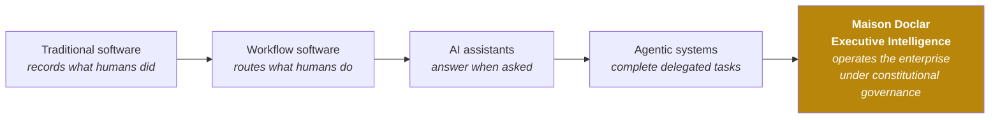
**Why the last step is different:** persistent goals over months (not tasks over minutes) · institutional memory under an epistemology (MKC) · authority that is delegated and revocable (not assumed) · every decision recorded with reasoning (Decision Intelligence) · autonomy *earned* through operational evidence (AMM) · and a human constitution above the AI, amendable only by humans.

## 3 · The Four Pillars
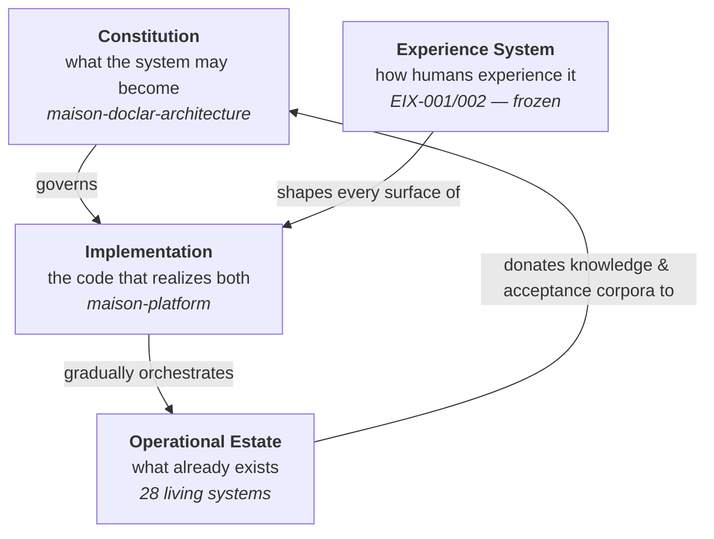
The Constitution defines authority and evolution. The Experience System is the behavioural specification of the AI — one intelligence, one voice, everywhere. The Implementation realizes both. The Estate keeps the business running and is orchestrated gradually, never replaced abruptly.

## 4 · The Organism
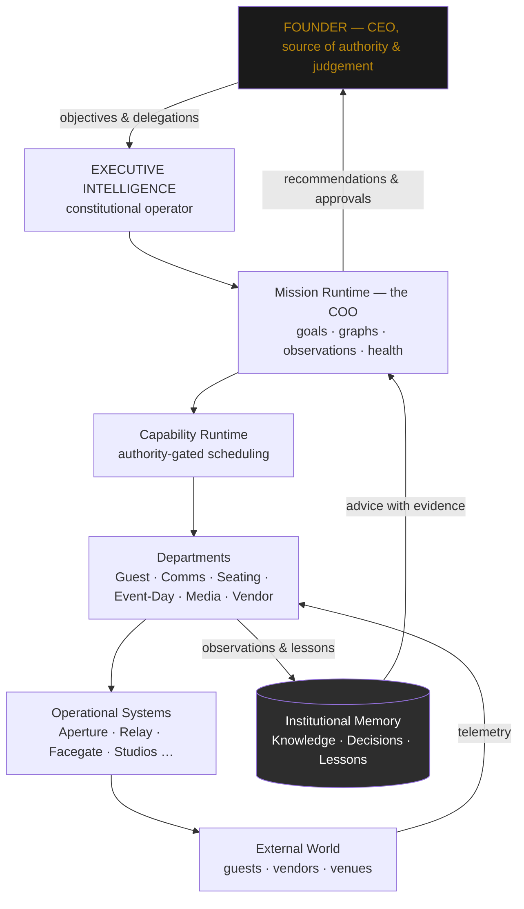

## 5 · The Nervous System
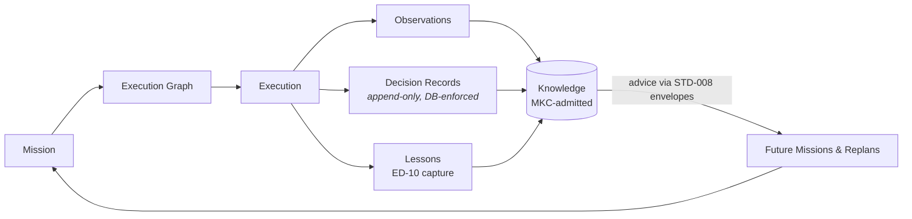
Every message crossing the execution↔intelligence boundary is one of six types (STD-008); every envelope carries reasoning or it is protocol-invalid; every decision closes as a database row; nothing is known that MKC has not admitted.

## 6 · Capability Catalogue (C1–C25)
Legend: 🟩 Substrate/partially **implemented** · 🟦 **Ratified** spec · 🟨 **Draft** spec · 🟪 **Deferred** (existing system realizes) · ⬜ **Reserved/Future**

| Domain | Capabilities |
|---|---|
| **Protocol & Experience law** | 🟨 C1 MPS (v1.0 awaiting founder) · C4 MXS (charter; constitution to author) |
| **Guest & Event operations** | 🟩🟨 C2 Guest (STD-002 + code) · 🟦 C3 Seating (STD-001 ratified + frozen STD-003/004/005) · 🟨 C5 Event-Day (STD-007) · 🟨 C7 Guest Experience (STD-010) · 🟨 C9 Access (STD-011) |
| **Communication & Media** | 🟨 C6 Communications (STD-006) · 🟨 C8 Media/Commission (STD-009) |
| **Business operations** | 🟨 C10 Reporting (STD-012) · 🟪 C11 Revenue · 🟪 C12 Vendor/Compliance · 🟪 C13 Planning (Nexus realizes) · 🟪 C14 Corporate Intel (Orion) |
| **Intelligence producers** | ⬜ C15 Venue · 🟨 C22 Event Intel (capture specified) · ⬜ C23 Vendor Intel (Venari donor) · 🟩 C24 Decision Intel (recording implemented) |
| **Platform kernel** | 🟩 C16 AI Governance (charter + runtime gate) · 🟩 C17 Identity (authority implemented) · 🟩 C18–C21 storage/delivery/workers/observability (partial) |
| **Orchestration** | 🟩 C25 Mission Planning (chartered DI-051, runtime implemented at L0–L1) |
| **Reserved** | ⬜ Engineering Intelligence (EI specialization) · ⬜ Maison Ontology System |

## 7 · Product Surfaces (EIX-002)
Sixteen surfaces, one intelligence. Navigation grammar: **S2 Command Bar reaches everything; S1 → S3 → domain is the descent (summary → mission → detail); S4 Approval Inbox is one action from anywhere.**
S1 Executive Dashboard · S2 Command Bar · S3 Mission Workspace · **S4 Approval Inbox (the L2 heart)** · S5 Operations Centre (+ Director/Concierge/Scanner/Kiosk device surfaces) · S6 Guest Workspace · S7 Communications Centre · S8 Seating Studio · S9 Host Workspace · S10 Guest Surfaces · S11 Vendor Workspace · S12 Creative Studio · S13 Founder Workspace (delegation console, AMM promotions, judgement capture) · S14 Intelligence & Knowledge Console · S15 Governance Console · S16 Engineering Intelligence Workspace (future). Every advisory touchpoint opens its reasoning in one click; every permanent human floor renders explicitly.

## 8 · Human Personas → primary surfaces
| Persona | Lives in | Also touches |
|---|---|---|
| Founder / CEO | S1, S13, S4 | S3, S14, S15 |
| Operations / Event Director | S3, S5, S7 | S6, S8, S11, S4 |
| Planner | S3, S6 (gated) | S8 view |
| Host (client principal) | S9 | S10 |
| Guest | S10 | — |
| Concierge / Scanner / Usher | Device surfaces (S5 family) | — |
| Creative team / Studios | S12 | S4 (proof approvals) |
| Suppliers / Vendors | (via S11-mediated comms) | — |
| Engineering (future EI oversight) | S16 | S15 |

## 9 · Mission Lifecycle
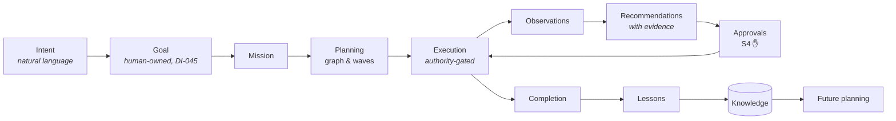

## 10 · The Intelligence Plane (what sits behind STD-008)
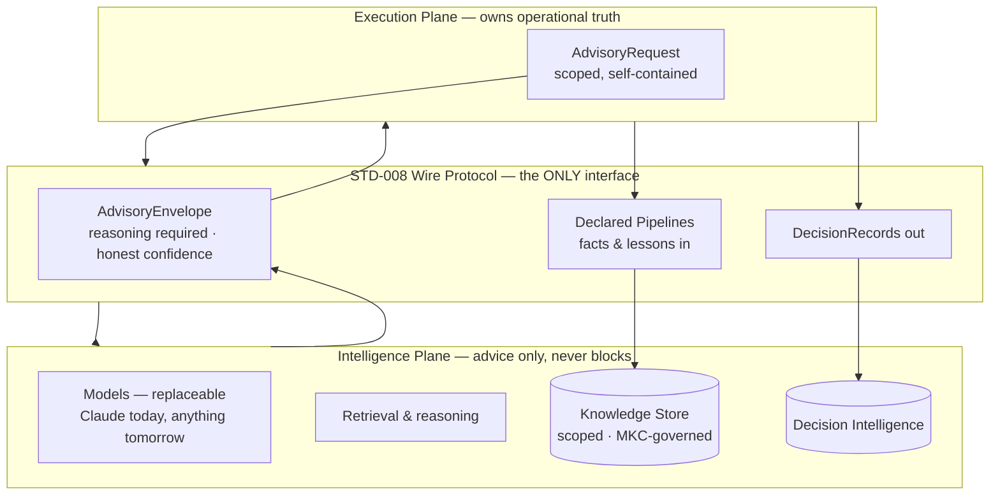
P-4 forbidden classes (political affiliation, biometrics, wealth signals, minors beyond count…) are rejected mechanically at the wire. Advice degrades to absence — no surface ever waits on intelligence.

## 11 · The Authority Model — capability ≠ authority
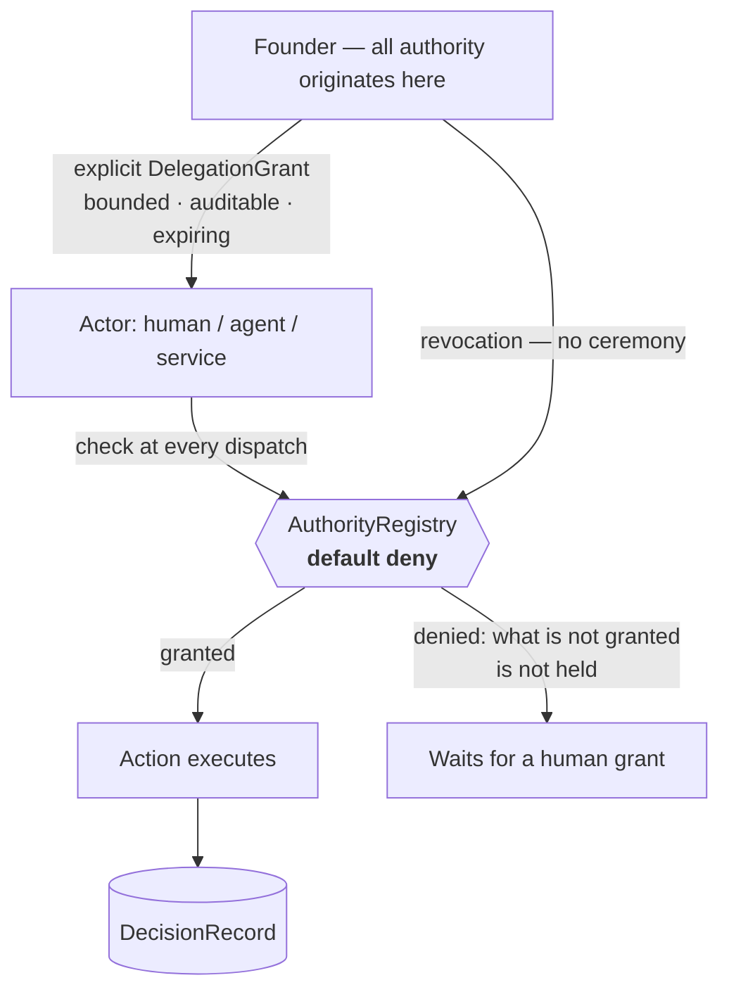
Permanent human floors regardless of autonomy level: money movement · host sign-off · MPS/MXS/MKC changes · delegation itself · biometric consent · constitutional amendment.

## 12 · Data Architecture
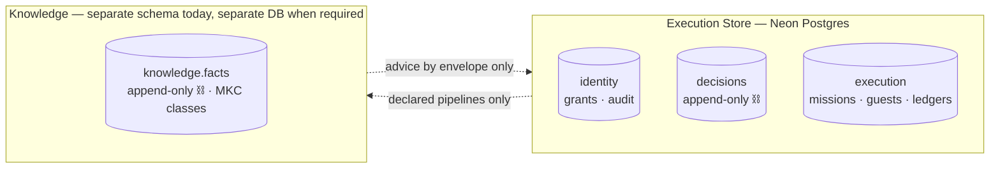
**Why guest data stays Event-scoped:** a guest's dietary needs, relationships, and title usage exist *for an event*, under that event's consent context. The CHECK constraint `subject_class LIKE 'guest%' → scope = 'Event'` lives in the database itself — cross-event guest profiling is unrepresentable, not merely prohibited. Cross-event learning is segment-aggregate only.

## 13 · Platform Architecture
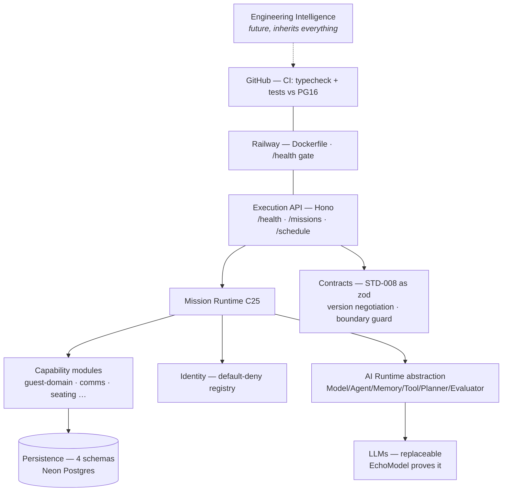

## 14 · The Estate — all 36 repositories
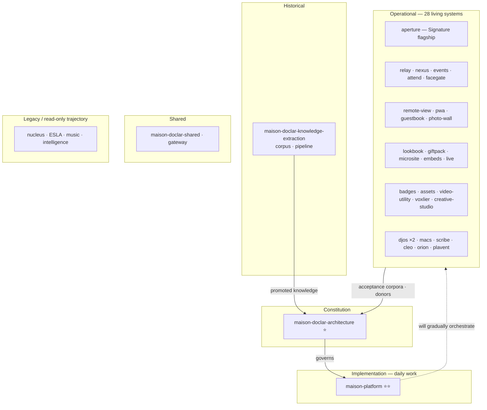
(urbanac excluded from scope permanently, DI-048.)

## 15 · Operational Systems → the capabilities they inform
| System | Informs | What it donated |
|---|---|---|
| Aperture (Signature) | C2 C3 C5 C6 C9 C10 | 89-model production reality; acceptance test corpora; the frozen seating lineage |
| Relay | C6 | Campaign model, WhatsApp/Twilio production knowledge, MPS title corpus |
| md-events / facegate / live | C5 C9 | Snapshot/Hub pipeline · EDR inward-flow · ShowControl |
| remote-view / pwa / guestbook / photo-wall / lookbook / giftpack / microsite / embeds | C7 | Guest surface donors; tenancy reference |
| Assets / video-utility / voxlier / creative-studio / badges / djos | C8 | Commission chain, channel-degradation recipes, worker registry |
| Nexus / Orion / macs / scribe / cleo | C11–C14, C24 | ERP facts by contract · decision-log donor · aso-ebi & lifecycle protocol |
| Nucleus / ESLA / music / intelligence | (knowledge banked) | Taxonomy · seating interaction workflow · negative knowledge |

## 16 · Roadmap — you are here
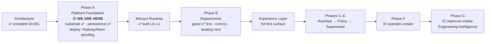

## 17 · Autonomy Maturity (AMM-001 v1.1)
| Level | Name | Meaning | Promotion requires |
|---|---|---|---|
| L0 | Manual | Humans operate; software records | — |
| L1 | Assisted | AI recommends via envelopes; humans decide | spec built |
| L2 | Coordinated | AI prepares & executes **on approval** (S4) | escalation channel proven |
| L3 | Autonomous | AI executes within ratified policy envelopes; humans handle exceptions | ~100 executions · <1% correction · zero violations · traces complete · rollback demonstrated |
| L4 | Self-improving | Long-horizon objectives; proposes its own improvements through governance | accumulated Mission-Health evidence; never scheduled by date |
Floors are level-independent. Demotion needs no ceremony.

## 18 · The Executive Experience (EIX — frozen v1.2)
Every screen, every capability, the same hierarchy:
```
1 SITUATION        47 guests have not responded.
2 RECOMMENDATION   Send the second reminder.
3 EVIDENCE         RSVP response has slowed below the expected curve.
4 ACTIONS          Approve · Delay · Review
5 DETAIL           Guest list · timeline · communication history
```
Plus the two defining laws: **the six-question principle** (every surface answers what/why/recommendation/consequence/risk/evidence before being asked — a screen that can't is not finished) and **the Analysis Rule** (the interface never asks a human to analyse what the Intelligence can analyse itself — humans exercise judgement, not data mining).

## 19 · An Example Day — "Deliver Prince Adeyemi's wedding"
**You type one sentence into S2.** The Intelligence drafts a **Goal** (yours, six-month horizon) → a **Mission** with objectives: guest · communications · seating · vendors · media · event-day → an execution graph lands in S3 for your approval. On approval: **C2 Guest** imports and reconciles 800 names (dedup *proposals* await a human in S6); **C6 Communications** stages save-the-dates — drafts appear in **S4** with evidence; you approve once. Weeks pass: telemetry → observations — *RSVP below curve* — health turns amber in S1; the Intelligence recommends a WhatsApp reminder stage, cites the curve, you approve from your phone. **C3 Seating** runs continuous proposals as confirmations land (frozen mathematical model; every placement explainable); the **Host reviews in S9** and signs — a permanent floor. **C8 Media** commissions the microsite ("three directions; Classic Emerald recommended — matches the invitation palette"); Studios signal **AT_RISK** on video → escalation, you pull the briefing forward. Event week: **C5** distributes snapshots to door devices; venue internet fails — the Hub ladder holds, nobody notices. Throughout: every dispatch authority-checked, every decision a database row, every lesson captured at doors/peak/teardown → **C22** → next wedding's priors. **You made perhaps twelve decisions in six months. All of them were judgement. None of them were data mining.**

## 20 · Future Vision — Phase G
The estate improves itself, within constitutional authority: **Engineering Intelligence** (an EI specialization, inheriting every rule) analyses repositories, proposes refactors, opens PRs, and deploys only through human-gated review with demonstrated rollback; **Creative Intelligence** deepens the one-voice studio; **Knowledge grows** through governed admission; behaviour changes only through governed channels — drift is a defect. The system may draft the amendment; **humans ratify, always. The founder remains the CEO.** The destination is an organization that continually improves itself while remaining constitutionally governed.

---

# 📍 LIVING DASHBOARD — the one page that always tells you where we are
*(update on every advance — DI-062 obligation)*

| | |
|---|---|
| **Current phase** | Phase A — Platform Foundation (Roadmap v1.2) |
| **Current milestone** | Deployability (DI-054) — code complete, awaiting Railway + Neon |
| **Current slice** | Slice 4 ✅ complete · next: Situation synthesis (DI-053 step 3) |
| **Current capability focus** | C25 Mission Runtime (built, L0–L1) · C2 Guest (built, in-memory + Pg) |
| **Open human decisions** | ① Founder session — MPS v1.0 + RSVP ruling + MXS authoring (gates 3 specs, Phase A) ② CTR-I1 (gates Phase C) ③ Spec dispositions: STD-002/006/007/008/009/010/011/012, ARCH-003 v1.2 ④ Read-only transitions (4 repos) on named instruction |
| **Current blockers** | Credential rotation pending (DI-064 two-identity model; handover PAT exposed, Workflows scope unverified) · Railway project not created · Neon DATABASE_URL not supplied · **API has no authentication — public routing withheld until it lands (DI-064)** |
| **Next Cursor prompt** | Slice 5: API authentication (local, unblocked) → Railway private deploy + Neon cutover on founder inputs → enable public routing → Situation synthesis (DI-064/DI-065) |
| **Recently completed** | Substrate (7 pkgs) · Mission Runtime · Guest domain · Persistence (4 schemas, DB-enforced constitution) · Execution API live-verified · GOV-009 handover · EIX frozen · DI-061 architecture closed |
| **Implementation progress** | 4/4 Phase-A slices · 16/16 tests · tsc clean · 8 platform commits |
| **Autonomy progress** | Everything L0–L1 · closureRate telemetry live (AMM evidence primitive) |
| **Specifications** | 1 ratified (STD-001) · 8 drafts · 3 frozen · MPS v1.0 in founder review |
| **Deployment status** | Local: verified end-to-end · Railway: not created · Neon: provisioned ◻unconfirmed · CI: authored, push blocked |
| **Experience status** | EIX-001 v1.2 FROZEN · EIX-002 mapped (16 surfaces) · 0 surfaces built · first: S4 |
